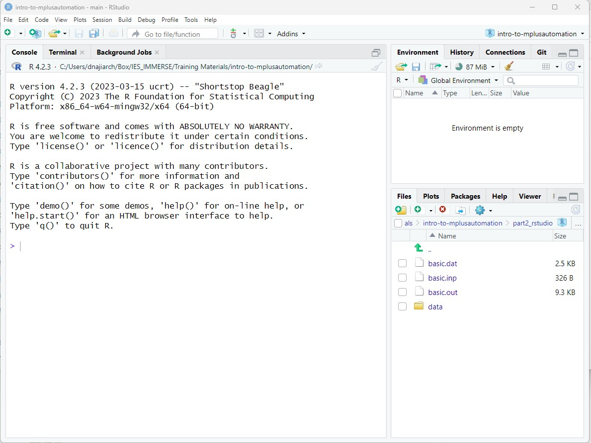
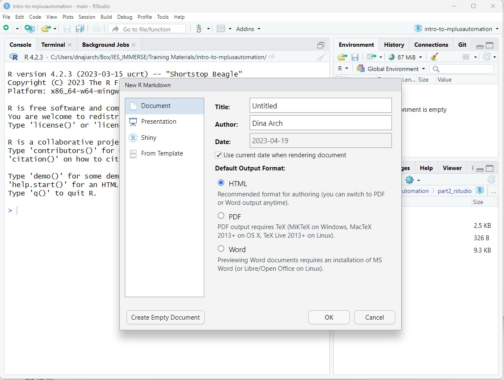

```{r setup, include=FALSE}
knitr::opts_chunk$set(echo = TRUE, warning = FALSE, message = FALSE) 
options(scipen=0)
```

# --------------------------------------------------------------------------------------

{style="float: left;" width="300"}

{style="float: left;" width="300"}

# --------------------------------------------------------------------------------------

> Mixture Modeling for Discipline Based Education Researchers (MM4DBER) is an NSF funded training grant to support STEM Education scholars in integrating mixture modeling into their research.

#### Download project materials here: [GitHub Repository](https://github.com/MM4DBER/Pre-training-Day5)

#### Return to landing page here: [MM4DBER Landing Page](https://mm4dber.github.io/)


# --------------------------------------------------------------------------------------

# Introduction:

- This walkthrough is presented by the MM4DBER team and will go through some common tasks carried out in R.
- There are many free resources available to get started with R and RStudio.
One of our favorites is [*R for Data Science*](https://r4ds.had.co.nz/).

# --------------------------------------------------------------------------------------

### Step 1: Open RStudio



Open R studio on your desktop.

**IMPORTANT**: Because we are using a package that communicates with Mplus, we *must* use have Mplus installed to run Rstudio.

# --------------------------------------------------------------------------------------

### Step 2: Create a new R-project


R-projects help us organize our folders , filepaths, and scripts.
To create a new R project:

0. File --\>  New Project...

1. Click "New Directory" --\> New Project --\> Name your project (e.g., "introR-day5")

**NOTE ABOUT PROJECT LOCATION (IMPORTANT)**: Choose a location on your computer that is not in too many enclosing folders. If your file path is too long (longer than 90 characters), Mplus cuts off the file.path and you will receive an **error message**. 

2. Click "Create Project" to save your project (It will save as a folder on your computer).

3. Copy all the materials found on Github into this new project folder you created.
    
# --------------------------------------------------------------------------------------

### Step 3: Create an R-markdown document



- [`R-markdown`](https://rmarkdown.rstudio.com/): The `R-markdown` format provides a platform for us to neatly share our data science results. It allows us to organize our reports using texts, figures, and R code.

- This document you are reading was made using R-markdown!

**To create an R-markdown:**

0. File --\> New File --\> R Markdown...

1. Give the R-markdown a title such as "**Introduction to Rstudio**" Click "OK." You should see a new markdown with some example text and code chunks.

2. Go ahead and save this document. Not that *.rmd* scripts are saved in the top project folder.

# --------------------------------------------------------------------------------------

### Step 4: Load packages

- The first code chunk (lines 8-10) is call the r setup code chunk. This will set the defaults for your document. For now we will leave this as is. 
- The next code chunk in any given R-markdown should be the packages you will be using.
- To insert a code chunk, either use the keyboard shortcut `ctrl + alt + i` OR click the green button with the letter `C` on it (top panel).
- There are a few packages we want to read in:

```{r}
library(psych)     # describe()
library(here)      # helps with specifying file paths
library(gt)        # create tables
library(tidyverse) # collection of R packages designed for data science

#install.packages("palmerpenguins")
library(palmerpenguins) # data for plot example
```

**Common error message types:** [E.g.,...] 

- If a function does not work and you receive an error message: `could not find function "xxx_function"` 
- or if you try to load a package and you receive an error like this: `` there is no package called `xxx_package` `` 
- then you will need to install the package using: `install.packages("xxx_package")` 

> NOTE: Once you have installed the package you will *never* need to install it again, however you must *always* load in the packages at the beginning of your R markdown using `library(xxx_package)`, as shown in this document.

> The style of code we will use relies on the [`tidyverse`](https://www.tidyverse.org/) package. Most functions we use for data manipulation are available within the `tidyverse` package and if not, I've indicated the packages used in the code chunk above.

# --------------------------------------------------------------------------------------

### Step 5: Make a quick plot (To show off what R can do!)

Look first
```{r}
head(penguins)
```

Plot!
```{r}

ggplot(data = penguins, aes(x = flipper_length_mm, fill = species)) +
  geom_histogram(position = "identity") 

# Extras to make plot pretty
# 1.  alpha = 0.5, 
# 2.  scale_fill_manual(values = c("darkorange","purple","cyan4"))
# 3.  labs(x = "Flipper length (mm)", y = "Frequency")
# 4.  theme_minimal()


```

# --------------------------------------------------------------------------------------

## Explore data

# --------------------------------------------------------------------------------------


### Step 6: Read in data

To demonstrate mixture modeling in the training program of the NSF grant we utilize the *Longitudinal Study of American Youth (LSAY)* data repository.

Table 1:

*LSAY Variable Descriptions*.

{style="float: left;" width="500"}

**To read in data in R:**
```{r}
data <- read_csv(here("data", "lsay_sci_data.csv")) 
```

**View data in R:**
```{r}
# 1. click on the data in your Global Environment (upper right pane) or use...
View(data)

# 2. summary() gives basic summary statistics & shows number of NA values
summary(data) 

# 3. names() provides a list of column names. Very useful if you don't have them memorized!
names(data)

# 4. head() prints the top 5 rows of the dataframe
head(data)
```

Look at a functions documentation: What does the `select()` function do?
```{r, eval=FALSE}

?select()
```

**Three useful keyboard shortcuts**:
1. Create a new code block: `Cmd + Option + I` (windows; `Ctrl + Alt + I`)
2. Inside a code block (`<-`): `option + dash (-)` 
3. Inside a code block (`%>%`): `Ctrl + Shift + M`

# --------------------------------------------------------------------------------------

### Step 7: Manipulating `data.frames` (select columns and filter rows)


Selecting variables or columns of a `data.frame`
```{r}
# Select columns one at a time
data_attitudes <- data %>% 
  select(Enjoy, Useful, Logical)

# Select columns left to right
data_attitudes <- data %>% 
  select(Enjoy:Adult)

# Remove columns
data_attitudes <- data %>% 
  select(-Female)
```


What if we want to look at a subset of the data?

- For example, what if we want to subset the data for female science attitudes? (`Female`)
- We can use `tidyverse::filter()` to subset the data using certain criteria.

```{r}
# Filter rows
data_female <- data %>% 
  filter(Female == 1) 

# You can use any operator to filter: >, <, ==, >=, etc.

data_female %>% nrow()

```

### Step 8: Descriptive Statistics

Let's look at descriptive statistics for each of the science attitude variables.

```{r}
data_attitudes %>% 
  summary()
```

Alternatively, we can use the `psych::describe()` function to give more information:

```{r}
data_attitudes %>% 
  describe()
```

Since we have binary data, it would be helpful to look at variable proportions:
```{r}
data %>% 
  drop_na() %>% 
  pivot_longer(Enjoy:Adult, names_to = "variable") %>% 
  group_by(variable) %>% 
  summarise(prop = sum(value)/n(),
            n = n()) %>%
  arrange(desc(prop))
```

# --------------------------------------------------------------------------------------

### Step 9: Knit document 

At the top menu click the `Knit` option and choose `Knit to HTML` 

# --------------------------------------------------------------------------------------

## References

Hallquist, M. N., & Wiley, J. F. (2018). MplusAutomation: An R Package for Facilitating Large-Scale Latent Variable Analyses in Mplus. Structural equation modeling: a multidisciplinary journal, 25(4), 621-638.

Muthén, L.K. and Muthén, B.O. (1998-2017). Mplus User's Guide. Eighth Edition. Los Angeles, CA: Muthén & Muthén

R Core Team (2017). R: A language and environment for statistical computing. R Foundation for Statistical Computing, Vienna, Austria. URL http://www.R-project.org/

Wickham et al., (2019). Welcome to the tidyverse. Journal of Open Source Software, 4(43), 1686, https://doi.org/10.21105/joss.01686

# --------------------------------------------------------------------------------------

{width="75%"}
