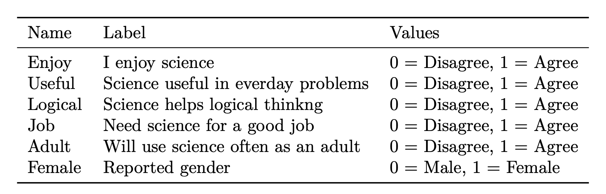

```{r, echo=FALSE}
htmltools::img(src = knitr::image_uri(file.path("images/mm4dber_white.jpg")), 
               alt = 'logo', 
               style = 'position:absolute; top:0; right:0; padding:10px;',
               width ="250",
               height ="193")

```

```{r setup, include=FALSE}
knitr::opts_chunk$set(echo = TRUE, warning = FALSE, message = FALSE) 
options(scipen=0)
```

# --------------------------------------------------------------------------------------

# MM4DBER Project

{style="float: left;" width="300"}

Mixture Modeling for Discipline Based Education Researchers (MM4DBER) is an NSF funded training grant to support STEM Education scholars in integrating mixture modeling into their research.

-   Please [visit our website](https://mm4dbers.education.ucsb.edu/) to learn more and apply for the year-long fellowship.

-   Follow us on [Twitter](https://twitter.com/mm4dbers)!

Visit our [GitHub](https://github.com/MM4DBER/intro-to-rstudio) account to download the materials needed for this walkthrough.

# --------------------------------------------------------------------------------------

# Introduction to R and RStudio

This walkthrough is presented by the MM4DBER team and will go through some common tasks carried out in R.
There are many free resources available to get started with R and RStudio.
One of our favorites is [*R for Data Science*](https://r4ds.had.co.nz/).

# --------------------------------------------------------------------------------------

## PART 1: Installation

# --------------------------------------------------------------------------------------

### Install: R, RStudio, and Mplus

- **Install R/Rstudio**: [Here](https://posit.co/download/rstudio-desktop/) you will find a guide to installing both R and R Studio.

- **Install Mplus**: To install the Mplus software go to their website [here](https://www.statmodel.com/orderonline/).

*Note*: The installation of Mplus requires a paid license with the mixture add-on.
MM4DBER fellows will be given their own copy of Mplus for use during the one year training.

# --------------------------------------------------------------------------------------

## PART 2: Set-up

# --------------------------------------------------------------------------------------

### Step 1: Create a new R-project in RStudio

R-projects help us organize our folders , filepaths, and scripts.
To create a new R project:

-   File --\> New Project...

Click "New Directory" --\> New Project --\> Name your project

### Step 2: Create an R-markdown document

An R-markdown file provides an authoring framework for data science that allows us to organize our reports using texts and code chunks.
This document you are reading was made using R-markdown!

To create an R-markdown:

-   File --\> New File --\> R Markdown...

In the window that pops up, give the R-markdown a title such as "**Introduction to R and RStudio**" Click "OK." You should see a new markdown with some example text and code chunks.
We want a clean document to start off with so delete everything from line 10 down.
Go ahead and save this document in your R Project folder.

### Step 3: Load packages

Your first code chunk in any given markdown should be the packages you will be using.
To insert a code chunk, etiher use the keyboard shortcut ctrl + alt + i or Code --\> Insert Chunk or click the green box with the letter C on it.
There are a few packages we want our markdown to read in:

```{r}
library(psych)     # describe()
library(here)      # helps with specifying file paths
library(gt)        # create tables
library(tidyverse) # collection of R packages designed for data science
```

**Common error message types:** [E.g.,...] 

- If a function does not work and you receive an error message: `could not find function "xxx_function"` 
- or if you try to load a package and you receive an error like this: `` there is no package called `xxx_package` `` 
- then you will need to install the package using: `install.packages("xxx_package")` 

> NOTE: Once you have installed the package you will *never* need to install it again, however you must *always* load in the packages at the beginning of your R markdown using `library(xxx_package)`, as shown in this document.

> The style of code we will use relies on the [`tidyverse`](https://www.tidyverse.org/) package. Most functions we use for data manipulation are available within the `tidyverse` package and if not, I've indicated the packages used in the code chunk above.

# --------------------------------------------------------------------------------------

## PART 3: Explore the data

# --------------------------------------------------------------------------------------

### Step 4: Read in data

To demonstrate mixture modeling in the training program of the NSF grant we utilize the *Longitudinal Study of American Youth (LSAY)* data repository.

Table 1:

*LSAY Variable Descriptions*.

{style="float: left;" width="500"}

**To read in data in R:**
```{r}
data <- read_csv(here("data", "lsay_sci_data.csv")) 
```

**View data in R:**
```{r}
# 1. click on the data in your Global Environment (upper right pane) or use...
View(data)

# 2. summary() gives basic summary statistics & shows number of NA values
summary(data) 

# 3. names() provides a list of column names. Very useful if you don't have them memorized!
names(data)

# 4. head() prints the top 5 rows of the dataframe
head(data)
```

### Step 5: Select Columns and Filter Rows
```{r}
# Select columns one at a time
data_attitudes <- data %>% 
  select(Enjoy, Useful, Logical)

# Select columns left to right
data_attitudes <- data %>% 
  select(Enjoy:Adult)

# Remove columns
data_attitudes <- data %>% 
  select(-Female)
```

What if we want to look at a subset of the data?

- For example, what if we want to subset the data for female science attitudes? (`Female`)
- We can use `tidyverse::filter()` to subset the data using certain criteria.

```{r}
# Filter rows
data_female <- data %>% 
  filter(Female == 1) 

# You can use any operator to filter: >, <, ==, >=, etc.

data_female %>% nrow()

```


### Step 6: Descriptive Statistics

Let's look at descriptive statistics for each of the science attitude variables.

```{r}
data_attitudes %>% 
  summary()
```

Alternatively, we can use the `psych::describe()` function to give more information:

```{r}
data_attitudes %>% 
  describe()
```

Since we have binary data, it would be helpful to look at variable proportions:
```{r}
data %>% 
  drop_na() %>% 
  pivot_longer(Enjoy:Adult, names_to = "variable") %>% 
  group_by(variable) %>% 
  summarise(prop = sum(value)/n(),
            n = n()) %>%
  arrange(desc(prop))
```


# --------------------------------------------------------------------------------------

## References

Hallquist, M. N., & Wiley, J. F. (2018). MplusAutomation: An R Package for Facilitating Large-Scale Latent Variable Analyses in Mplus. Structural equation modeling: a multidisciplinary journal, 25(4), 621-638.

Muthén, L.K. and Muthén, B.O. (1998-2017). Mplus User's Guide. Eighth Edition. Los Angeles, CA: Muthén & Muthén

R Core Team (2017). R: A language and environment for statistical computing. R Foundation for Statistical Computing, Vienna, Austria. URL http://www.R-project.org/

Wickham et al., (2019). Welcome to the tidyverse. Journal of Open Source Software, 4(43), 1686, https://doi.org/10.21105/joss.01686

# --------------------------------------------------------------------------------------

{width="75%"}
